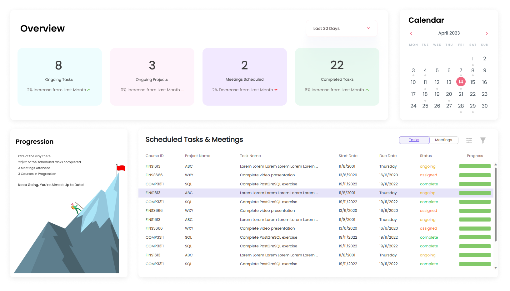
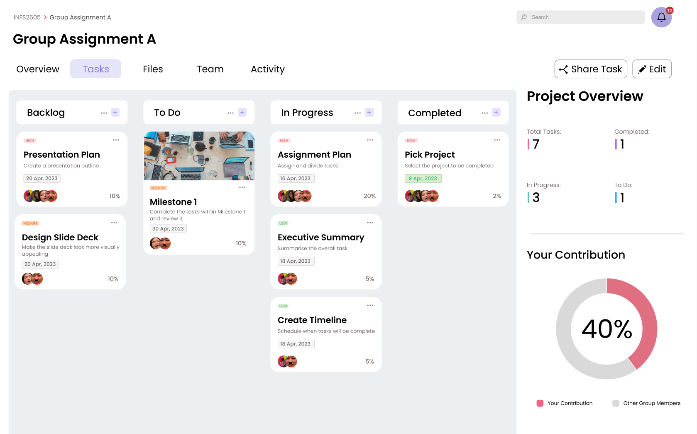

<a name="readme-top"></a>

<!-- https://www.markdownguide.org/basic-syntax/#reference-style-links -->

<!-- [![Contributors][contributors-shield]][contributors-url]
[![Forks][forks-shield]][forks-url]
[![Stargazers][stars-shield]][stars-url]
[![Issues][issues-shield]][issues-url]
[![MIT License][license-shield]][license-url]
[![LinkedIn][linkedin-shield]][linkedin-url] -->

<!-- PROJECT LOGO & DESCRIPTION & IMAGES -->
<br />
<div align="center">
  <a href="https://github.com/LexicusRex/ever-flow">
    
  </a>

  <p align="center">
    An integrated productivity platform centred around collaborative writing, workflow management and performance evaluation.
    <br />
    <!-- <a href="https://github.com/LexicusRex/ever-flow"><strong>❌Explore the docs »</strong></a>
    <br /> -->
    <br />
    <a href="#about-the-project">About The Project</a>
    ·
    <a href="#getting-started">Getting Started</a>
    ·
    <!-- <a href="#usage">Usage</a>
    · -->
    <a href="#roadmap">Roadmap</a>
    ·
    <a href="#license">License</a>
    ·
    <a href="#contact">Contacts</a>
    ·
    <a href="#acknowledgments">Acknowledgments</a>
  </p>
</div>

<!-- PROJECT FEATURES -->




## About The Project

A user-friendly web-based word processor with integrated project management tools
targeting students and educators in higher education institutions.

The application will measure, track and distribute student performance metrics in collaboration projects to educators to allow for effective evaluation and conflict resolution.

### Built With

<div style="display: flex">

[![React][React.js]][React-url]
[![Bootstrap][Bootstrap.com]][Bootstrap-url]
[![Pocketbase][Pocketbase.io]][Pocketbase-url]

</div>

<!-- GETTING STARTED -->

## Getting Started

To get this project going locally, please ensure the following.

### Prerequisites

-   npm
    ```sh
    npm install npm@latest -g
    ```
-   [PocketBase](https://github.com/pocketbase/pocketbase)
    -   PocketBase is a open source backend SQLite database. For more, please head to their GitHub page [here](https://github.com/pocketbase/pocketbase).
    -   Download PocketBase [here](https://pocketbase.io/).

### Installation

To clone and run this project, ensure you have [Git](https://git-scm.com/), [Node.js](https://nodejs.org/en/download/) (via [npm](http://npmjs.com/)), and [PocketBase](https://pocketbase.io/) installed ([see here](#prerequisites)).

```bash
# Clone the repository
$ git clone https://github.com/LexicusRex/ever-flow

# Head into the directory
$ cd everflow

# Install dependencies
$ npm install

# Run the app
$ npm start
```

In a different command line instance, head to your PocketBase directory and run:

```bash
$ ./pocketbase serve
```

Use the **Admin UI** to experiment around with the database.

<!-- USAGE EXAMPLES -->

<!-- ## Usage

❌

Use this space to show useful examples of how a project can be used. Additional screenshots, code examples and demos work well in this space. You may also link to more resources. -->

<!-- _For more examples, please refer to the [Documentation](https://example.com)_ -->

<!-- ROADMAP -->

## Roadmap

### User Interface:

-   [x] Log-in
-   [x] Sign-up
-   [ ] Dashboard (WIP)
-   [ ] View projects
-   [ ] View tasks
-   [ ] Task Creation
-   [ ] Timeline (maybe Gantt chart)
-   [ ] Kanban board
-   [ ] Word processor
-   [ ] Analytics page

### Functionality

-   [ ] Database integration
-   [ ] Authorisation & Authentication
-   [ ] Persistent user login
-   [ ] User performance evaluation
    -   [ ] Progress tracker
-   [ ] Semantic evaluation within word processor
-   [ ] User report generation

See the [open issues](https://github.com/LexicusRex/ever-flow/issues) for a full list of proposed features (and known issues).

<!-- LICENSE -->

## License

Currently unlicensed. The **default copyright laws apply**. You may **NOT** distribute, reproduce or derive works from this project.

<!-- Distributed under the MIT License. See `LICENSE.txt` for more information. -->

<!-- CONTACT -->

## Contacts

<!--
LexicusRex - [@twitter_handle](https://twitter.com/twitter_handle) - email@email_client.com -->

GitHub [@LexicusRex](https://github.com/LexicusRex) &nbsp;&middot;&nbsp;
LinkedIn [Alex Xu](https://www.linkedin.com/in/alex-tian-xu/) &nbsp;&middot;&nbsp;
Project Link: [ever-flow](https://github.com/LexicusRex/ever-flow)

GitHub [@samyu1204](https://github.com/samyu1204)

<!-- ACKNOWLEDGMENTS -->

## Acknowledgments

This project uses the following open source modules:

-   [PocketBase](https://github.com/pocketbase/pocketbase)
-   [Node.js](https://nodejs.org/)
-   [Tailwind CSS](https://github.com/tailwindlabs/tailwindcss)
-   [clsx](https://github.com/lukeed/clsx)
-   [react-hook-form](https://github.com/react-hook-form/react-hook-form)
-   [react-icons](https://github.com/react-icons/react-icons)
-   [react-query](https://github.com/TanStack/query)
-   [react-router-dom](https://github.com/remix-run/react-router)
-   [react-modern-calendar-datepicker](https://github.com/Kiarash-Z/react-modern-calendar-datepicker)

<!-- MARKDOWN LINKS -->

[linkedin-shield]: https://img.shields.io/badge/-LinkedIn-black.svg?style=for-the-badge&logo=linkedin&colorB=555
[linkedin-url]: https://linkedin.com/in/linkedin_username
[React.js]: https://img.shields.io/badge/React-20232A?style=for-the-badge&logo=react&logoColor=61DAFB
[React-url]: https://reactjs.org/
[Bootstrap.com]: https://img.shields.io/badge/Bootstrap-563D7C?style=for-the-badge&logo=bootstrap&logoColor=white
[Bootstrap-url]: https://getbootstrap.com
[JQuery.com]: https://img.shields.io/badge/jQuery-0769AD?style=for-the-badge&logo=jquery&logoColor=white
[JQuery-url]: https://jquery.com
[Pocketbase.io]: https://img.shields.io/badge/PocketBase-f6f6f6?style=for-the-badge&logo=pocketbase&logoColor=black
[Pocketbase-url]: https://pocketbase.io/
